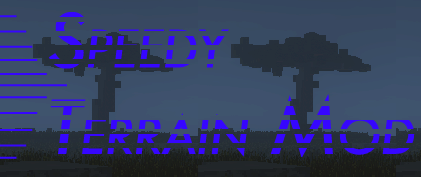

[![Contributors][contributors-shield]][contributors-url]
[![Forks][forks-shield]][forks-url]
[![Stargazers][stars-shield]][stars-url]
[![Issues][issues-shield]][issues-url]
[![MIT License][license-shield]][license-url]
[![Discord][discord-shield]][discord-url]

 

  

<h3 align="center">SpeedyTerrainMod by Aaron Speedy</h3>

  

    Minecraft's Leading Data-Driven Worldgen Engine
     
    <a href="https://openterraingen.fandom.com"><strong>Explore the docs »</strong></a>
     
     
    <a href="https://www.openterraingenerator.org/presets.html">See Our Presets</a>
    ·
    <a href="https://github.com/othneildrew/Best-README-Template/issues">Report Bugs</a>
    ·
    <a href="https://discord.gg/YY2NECCBYN">Join our Discord</a>
  

## SpeedyTerrainMod by Aaron Speedy

SpeedyTerrainMod for MC 1.21.5 is under development, alpha builds are available under Releases.

## Credits

We are always looking for people to contribute/collaborate with. We encourage community contribution because of our Open Source model, and we thank those who develop presets, contribute code, and have worked on this project in the past.

### SpeedyTerrainMod Contributors
* <a href="https://github.com/Aaron-Speedy">Aaron Speedy</a>
* <a href="https://github.com/FrankTCA">Frank from Info Toast</a>

SpeedyTerrainMod is based off <a href="https://github.com/FrankTCA/OpenTopG">FrankTCA's OpenTerrainGenerator fork</a> which is based off <a href="https://github.com/PG85/OpenTerrainGenerator">OpenTerrainGenerator</a>, developed by Team OTG:

* <a href="https://github.com/PG85">PG85</a>
* MCPitman
* <a href="https://github.com/authvin">Authvin</a>
* <a href="https://github.com/Coll1234567">Josh</a>
* <a href="https://github.com/SuperCoder7979">SuperCoder79</a>
* <a href="https://github.com/SXRWahrheit">Wahrheit</a>
* <a href="https://infotoast.org">Frank from Info Toast</a>

OpenTerrainGenerator is based off <a href="https://github.com/mctcp/TerrainControl">TerrainControl</a>, developed by:

* <a href="https://github.com/rutgerkok">rutgerkok</a>
* <a href="https://github.com/Wickth">Wickth</a>
* <a href="https://github.com/Timethor">Timethor</a>
* <a href="https://github.com/oloflarsson">oloflarsson</a>
* <a href="https://github.com/bloodmc">bloodmc</a>

TerrainControl is the successor
to <a href="http://www.minecraftforum.net/topic/313991-phoenixterrainmod/">PhoenixTerrainMod</a>, which was based
on <a href="http://www.minecraftforum.net/topic/71565-biomemod/">BiomeTerrainMod</a>.

* Buycruss - BiomeTerrainMod
* R-T-B - PhoenixTerrainMod

## Installation / building

- As with Forge mods, download the repo, then run /gradlew genEclipseRuns, then /gradlew eclipse (for Eclipse IDE).
- To create a release jar in the build folder, update the build version in build.gradle, then run /gradlew
  createReleaseJar.
- If you're having problems, make a sacrifice to the gradle gods and/or run /gradlew clean and /gradlew
  --refresh-dependencies.

### IntelliJ Building Instructions

- Instead of running /gradlew genEclipseRuns, just run /gradlew genIntellijRuns.
- Then, all you have to do is Open IntelliJ and import the project folder, make sure you Trust the gradle project, and
  IntelliJ will do the rest :)
- Follow the same instructions that you do for Eclipse if you want to build -- do note that IntelliJ has a gradle GUI
  that you can use once you've imported the project. (Should be on the right of the code.)

## Links

* [Wiki](http://openterraingen.wikia.com/wiki/Open_Terrain_Generator_Wiki)
* [Discord](https://discord.com/invite/UXzdVTH)
* [Installation](https://openterraingen.fandom.com/wiki/Installing_OTG) for Spigot and Forge

[contributors-shield]: https://img.shields.io/github/contributors/Aaron-Speedy/SpeedyTerrainMod.svg?style=for-the-badge

[contributors-url]: https://github.com/Aaron-Speedy/SpeedyTerrainMod/graphs/contributors

[forks-shield]: https://img.shields.io/github/forks/Aaron-Speedy/SpeedyTerrainMod.svg?style=for-the-badge

[forks-url]: https://github.com/Aaron-Speedy/SpeedyTerrainMod/network/members

[stars-shield]: https://img.shields.io/github/stars/Aaron-Speedy/SpeedyTerrainMod.svg?style=for-the-badge

[stars-url]: https://github.com/Aaron-Speedy/SpeedyTerrainMod/stargazers

[issues-shield]: https://img.shields.io/github/issues/Aaron-Speedy/SpeedyTerrainMod.svg?style=for-the-badge

[issues-url]: https://github.com/Aaron-Speedy/SpeedyTerrainMod/issues

[license-shield]: https://img.shields.io/github/license/Aaron-Speedy/SpeedyTerrainMod.svg?style=for-the-badge

[license-url]: https://github.com/Aaron-Speedy/SpeedyTerrainMod/blob/master/LICENSE.txt

[linkedin-shield]: https://img.shields.io/badge/-LinkedIn-black.svg?style=for-the-badge&logo=linkedin&colorB=555

[linkedin-url]: https://linkedin.com/in/linkedin_username

[discord-shield]: https://img.shields.io/discord/307111022257373185?style=for-the-badge

[discord-url]: https://discord.gg/YY2NECCBYN

[product-screenshot]: images/screenshot.png
